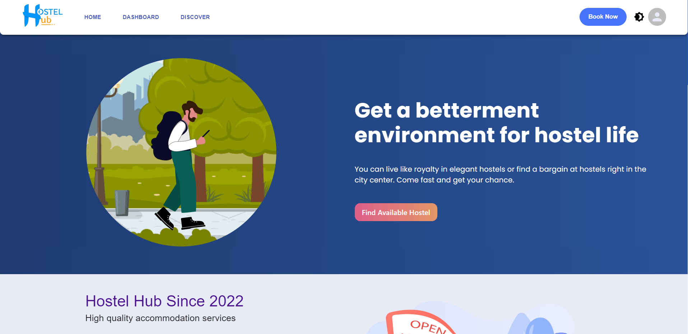

# Hostel Hub

Project Documentation Outcome till the 4th week of Endgame

We Used Typescript for our main frontend portion.
Used Redux-toolkit for state management.
The redux-toolkit initial step for authentication (Tareq Hassan)
Implemented MUI theming system. (Tareq Hassan)
Build a Navigation bar with various routing pages.
Also, we created Registration and Login pages with a secure authentication system with Firebase. (Tareq Hassan)
We build a user and admin dashboard as one of our major features.
Made a Banner section on our Home-page with fancy animations using react lotty. (Mahmudul Hasan)
Created the major services that will be provided through our project.
Search field and category-wise search implementation system used. (Amirul Islam)
Made an App Feature section to advertise our App against our website. (Mahmudul Hasan)
We created a section featuring all the sponsors and partners.
Also, we created a footer section where the contact details and basic information have been provided. (Tareq Hassan)
We made a cart page with effects where the selected services will be added. (Rashidul Islam)
Used TypeScript as our primary language for our server-side. (Tareq Hassan)
Connected to Backend using RTK query.
Used Mongoose for maintaining the MongoDB database.
A form for advertising available sit. (Rashidul Islam)
Searching old products. (Mahmudul Hasan)
Searching goods for a hostel. (Mahmudul Hasan)

## Home Page

## Dashboard

## Discover page

Live site: https://hostel-hub-7d3bf.web.app/

set on your env

REACT_APP_BASE_URL=https://hostel-hub-new-server.herokuapp.com/api/v1/
